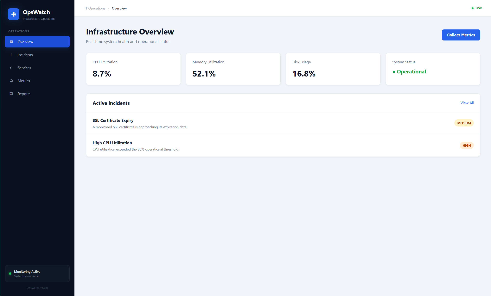
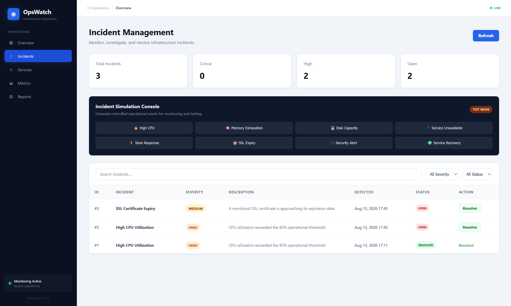
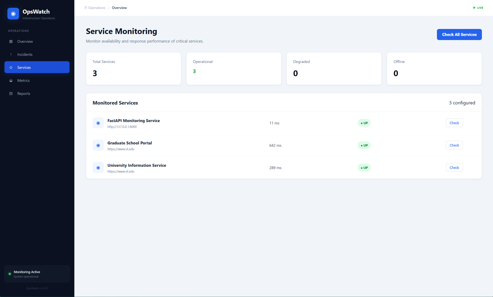
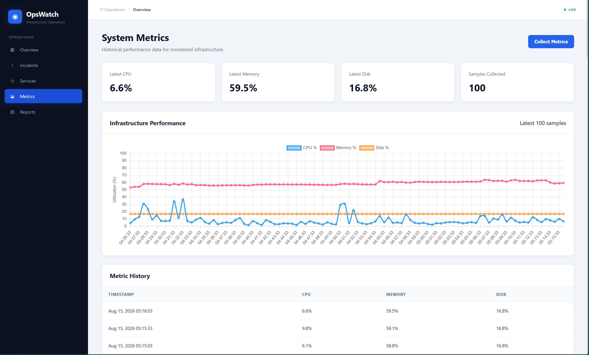
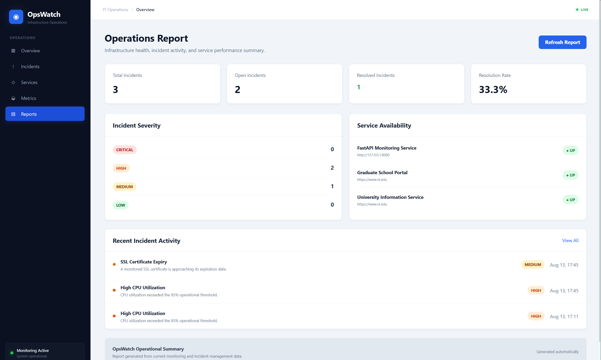

# OpsWatch — IT Infrastructure Monitoring & Incident Management

A web-based IT infrastructure monitoring and incident management platform designed to provide centralized visibility into system health, operational incidents, services, metrics, and infrastructure reports.

OpsWatch demonstrates practical experience in **IT operations, infrastructure monitoring, incident management, REST API development, database-backed workflows, and operational reporting**.

---

## Overview

OpsWatch provides a centralized operations dashboard for monitoring infrastructure health and managing operational incidents.

```text
┌─────────────────────────────┐
│      Infrastructure         │
│       Environment           │
└──────────────┬──────────────┘
               │
               ▼
┌─────────────────────────────┐
│      Metric Collection      │
│                             │
│ CPU / Memory / Disk         │
└──────────────┬──────────────┘
               │
               ▼
┌─────────────────────────────┐
│       Health Analysis       │
└──────────────┬──────────────┘
               │
        ┌──────┴──────┐
        ▼             ▼
┌──────────────┐ ┌──────────────┐
│   Incidents  │ │   Services   │
│   & Issues   │ │   Monitoring │
└──────┬───────┘ └──────┬───────┘
       │                │
       └────────┬───────┘
                ▼
       ┌─────────────────┐
       │    Reporting    │
       └─────────────────┘
```

---

## Key Features

* Real-time infrastructure health dashboard
* CPU utilization monitoring
* Memory utilization monitoring
* Disk utilization monitoring
* Automated system metric collection
* Infrastructure health checks
* Incident detection and tracking
* Incident severity management
* Incident status management
* Service monitoring
* Historical metric storage
* REST API endpoints
* PostgreSQL database integration
* Operational reporting
* Web-based operations interface

---

## Technology Stack

| Category              | Technology            |
| ---------------------- | ---------------------- |
| Programming Language  | Python                |
| Backend Framework     | FastAPI               |
| Database              | PostgreSQL            |
| ORM                   | SQLAlchemy            |
| System Monitoring     | psutil                |
| Server-Side Rendering | Jinja2                |
| Frontend              | HTML, CSS, JavaScript |
| API                    | REST                  |
| Application Server    | Uvicorn               |
| Version Control       | Git / GitHub          |

---

## Architecture

OpsWatch follows a lightweight web application architecture:

```text
                 ┌──────────────────────┐
                 │      Web Browser     │
                 │    HTML / CSS / JS   │
                 └──────────┬───────────┘
                            │
                            ▼
                 ┌──────────────────────┐
                 │       FastAPI        │
                 │    Routes / APIs     │
                 └──────────┬───────────┘
                            │
                ┌───────────┴───────────┐
                │                       │
                ▼                       ▼
       ┌────────────────┐      ┌────────────────┐
       │    Monitoring  │      │   Incident     │
       │    Engine      │      │   Management   │
       └───────┬────────┘      └────────┬───────┘
               │                        │
               └───────────┬────────────┘
                           ▼
                 ┌──────────────────────┐
                 │      SQLAlchemy      │
                 │         ORM          │
                 └──────────┬───────────┘
                            │
                            ▼
                 ┌──────────────────────┐
                 │      PostgreSQL      │
                 └──────────────────────┘
```

---

## Infrastructure Monitoring

OpsWatch collects and stores three core infrastructure metrics:

### CPU Utilization

Tracks system processor utilization to identify high-load conditions.

### Memory Utilization

Tracks memory consumption to identify potential resource exhaustion.

### Disk Utilization

Tracks disk usage to identify capacity-related infrastructure issues.

The monitoring layer uses `psutil` to collect system-level information.

---

## Incident Management

OpsWatch provides an incident workflow for identifying and tracking infrastructure problems.

Each incident can contain:

* Incident type
* Severity
* Description
* Status
* Detection timestamp

Example incident categories include:

```text
High CPU
High Memory
High Disk Usage
Service Failure
Infrastructure Issue
```

Incident statuses can be used to track an issue through its operational lifecycle.

---

## Service Monitoring

The Services interface provides visibility into monitored infrastructure services.

Service information can be used to track:

* Service name
* Service status
* Availability
* Operational condition

This provides a centralized view of service health alongside infrastructure metrics and incidents.

---

## Metrics

The Metrics interface provides historical infrastructure information collected by the monitoring system.

Metrics can be used to analyze:

* CPU utilization
* Memory utilization
* Disk utilization
* Collection timestamps

This creates a persistent operational record that can be used for troubleshooting and infrastructure analysis.

---

## REST API

OpsWatch exposes REST endpoints for operational data and monitoring functions.

Example endpoints include:

```text
GET  /api/metrics
POST /api/collect
GET  /api/incidents
```

The API allows monitoring data to be consumed programmatically and provides a foundation for integration with other IT systems.

---

## Database

OpsWatch uses **PostgreSQL** for persistent storage.

The database stores operational information associated with:

* Infrastructure metrics
* Incidents
* Services
* Timestamps
* Incident status
* Incident severity

SQLAlchemy provides the ORM layer between the FastAPI application and PostgreSQL.

---

## Operational Workflow

A typical OpsWatch workflow is:

```text
1. Collect Infrastructure Metrics
              ↓
2. Store Metrics
              ↓
3. Evaluate System Health
              ↓
4. Identify Operational Issues
              ↓
5. Create / Track Incidents
              ↓
6. Monitor Services
              ↓
7. Review Historical Metrics
              ↓
8. Generate Operational Reports
```

---

## Project Structure

```text
IT Infrastructure Monitor/
│
├── app.py
├── database.py
├── models.py
├── monitoring.py
├── requirements.txt
│
├── templates/
│   ├── base.html
│   ├── dashboard.html
│   ├── incidents.html
│   ├── services.html
│   ├── metrics.html
│   └── reports.html
│
└── static/
    ├── css/
    │   └── style.css
    │
    └── js/
        └── dashboard.js
```

---

## Screenshots

### Operations Dashboard



The dashboard provides an overview of infrastructure health and active incidents.

---

### Incident Management



The incident interface provides centralized visibility into operational issues, severity, descriptions, and resolution status.

---

### Service Monitoring



The services interface provides an operational view of monitored services.

---

### Infrastructure Metrics



The metrics interface provides historical system utilization data.

---

### Operational Reports



The reports interface summarizes infrastructure and incident activity.

---

## Running Locally

### Requirements

* Python 3.10+
* PostgreSQL
* Git
* Python virtual environment

### Clone the Repository

```bash
git clone https://github.com/YOUR_USERNAME/IT-Infrastructure-Monitor.git
```

Navigate into the project:

```bash
cd IT-Infrastructure-Monitor
```

---

### Create a Virtual Environment

Windows:

```powershell
python -m venv venv
```

Activate it:

```powershell
.\venv\Scripts\Activate.ps1
```

---

### Install Dependencies

```powershell
pip install -r requirements.txt
```

---

### Configure PostgreSQL

Create a PostgreSQL database for OpsWatch and configure the database connection according to the application's local configuration.

Example:

```text
PostgreSQL
    │
    └── OpsWatch Database
            │
            ├── Metrics
            ├── Incidents
            └── Services
```

Do not commit:

* Database passwords
* API keys
* Access tokens
* Environment secrets

---

### Start the Application

```powershell
python -m uvicorn app:app --reload
```

The application will be available at:

```text
http://127.0.0.1:8000
```

---

## API Usage

### Retrieve Latest Metrics

```text
GET /api/metrics
```

Example response:

```json
{
  "cpu": 32.4,
  "memory": 58.1,
  "disk": 47.3,
  "timestamp": "2026-08-14T20:00:00"
}
```

### Collect New Metrics

```text
POST /api/collect
```

### Retrieve Incidents

```text
GET /api/incidents
```

The incident endpoint returns operational information including:

```json
{
  "id": 1,
  "type": "High CPU",
  "severity": "HIGH",
  "description": "CPU utilization exceeded threshold.",
  "status": "OPEN",
  "detected_at": "2026-08-14T20:00:00"
}
```

---

## Engineering Focus

OpsWatch was developed to demonstrate practical experience in:

* IT infrastructure monitoring
* System-level resource monitoring
* Incident management
* Service health monitoring
* REST API development
* FastAPI backend development
* PostgreSQL database integration
* SQLAlchemy ORM
* Operational dashboards
* Historical metrics analysis
* Infrastructure troubleshooting
* IT operations workflows
* Operational reporting

---

## Future Improvements

Potential future enhancements include:

* Automated alert notifications
* Email / Microsoft 365 integration
* AWS CloudWatch integration
* Multi-server monitoring
* Distributed monitoring agents
* Role-based access control
* Incident assignment
* Incident escalation workflows
* Historical metric visualization
* Threshold configuration
* Automated incident creation
* CI/CD integration
* Health-check scheduling

---

## Author

**Somak Goswami**

M.S. Electrical Engineering
Virginia Tech

GitHub: `YOUR_GITHUB_PROFILE`

LinkedIn: `YOUR_LINKEDIN_PROFILE`

---

## License

This project is intended as a portfolio and educational project.
